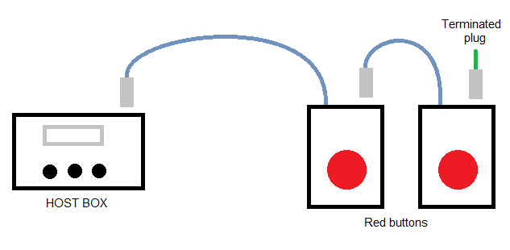
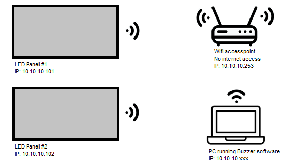

# LD NVHB - Buzzer set

In this repo:
- Controller Board for LED panel - using ESP32 for wifi functionality
- Firmware for ESP32 to drive 64x32 RGB LED panel
- Windows PC app to send data, in real-time, to all LED panels

LD NVHB buzzer set:
- 20x Red buttons
- 9x LED panels
- 2x host boxes
- 1x Power supply 12V20A, using a toolbox as the enclosure
- 1x Wifi accesspoint, repurposed from an old Telstra modem
- 10x DC cables
- 19x 3.5mm cable
- 3x 12V2A wall adapter

This buzzer set comprises by 2 systems
- Buzzer system: Red buttons, a host box, small 12V adapter
- Display system: LED panels, wifi accesspoint, computer running PC app 

